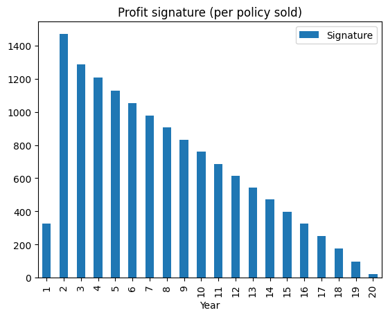

# Profit Test: 20-Year Term Assurance

## Objective
Project the profit emerging from a single 20-year level term assurance policy,
and measure how sensitive the result is to mortality, lapse, interest and
discount-rate assumptions.

## Product and assumptions
| Item | Assumption |
|---|---|
| Entry age | 30 |
| Term | 20 years |
| Sum assured | 10,00,000 |
| Annual premium | 2,500, paid at the start of each year |
| Mortality | AM92 (select and ultimate), 100% of table |
| Lapses | 15% in year 1, 10% in year 2, 5% thereafter (illustrative) |
| Expenses | Year 1: 50% of premium + 500. Renewal: 10% of premium + 100 (illustrative) |
| Investment return | 7% a year |
| Risk discount rate | 10% a year |
| Reserves | Assumed zero (simplification) |

Mortality rates are the AM92 table from the CMI's 92 series (UK assured male
lives, 1991-94 experience). The table gives death probabilities (q) with
duration 0, duration 1 and ultimate columns. I use the select columns for
policy years 1 and 2 and the ultimate column from year 3.
Lapse and expense figures are my own illustrative assumptions, not company data.

## Method
1. Read the death probability for each policy year from AM92.
2. Calculate the probability the policy is still in force at the start of each year.
3. Calculate the expected profit per policy in force: premium less expenses, plus
   interest for the year, less expected death claims.
4. Multiply by the in-force probability to get the profit signature.
5. Discount the signature at the risk discount rate to get the NPV.
6. Profit margin = NPV / present value of premiums.

## Results
**Base case:** NPV = 7,154, profit margin = 47.2%

**Sensitivities:**
Scenario	NPV	Margin %
0	Base	7154	47.25
1	AM92 at 120%	6320	41.77
2	AM92 at 80%	7990	52.73
3	Lapses +50%	5794	46.72
4	Lapses -50%	8839	47.32
5	Interest 5%	6943	45.85
6	Risk discount 12%	6450	46.47

   

## Key observations
- <Which scenario hurts profit most, and why?>
- <Why year 1 is weak: initial expenses exceed the first premium>
- <How extra lapses change profit, and why that happens for term assurance>

## Limitations
- Reserves are assumed to be zero. A real profit test would include reserves
  and the cost of holding capital.
- Lapse and expense assumptions are illustrative.
- AM92 is a UK table based on 1991-94 data and would not be used unadjusted for
  pricing in India.
- Deaths and lapses are assumed to occur at the end of the year, with no
  lapse-and-death interaction within a year.

## Possible extensions
- Add net premium reserves.
- Compare results using the IALM 2012-14 table.
- Use lapse rates derived from a persistency analysis.

## How to run
1. Open `profit_test_term_assurance.ipynb` in Google Colab.
2. Upload `am92.csv` (in this folder) using the file panel on the left.
3. Run all cells from top to bottom.

## Files
- `profit_test_term_assurance.ipynb`: the model
- `am92.csv`: AM92 death probabilities (age, duration 0, duration 1, ultimate)
